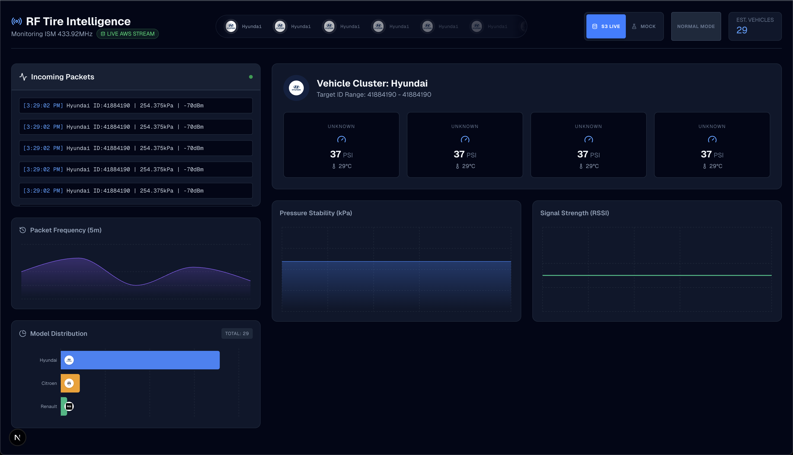

This is a [Next.js](https://nextjs.org) project bootstrapped with [`create-next-app`](https://nextjs.org/docs/app/api-reference/cli/create-next-app).

# NOTE
Make sure you have a .env.local file made or it probably wont work, also got to do npm install to install the packages. .env.local example:
```
AWS_REGION=us-east-1
AWS_ACCESS_KEY_ID=YourKeyHere
AWS_SECRET_ACCESS_KEY=YourKeyHere
AWS_S3_BUCKET_NAME=raspberry-pi-mqtt-data-lake
AWS_S3_PREFIX=sdk/hivemq/data/   # or whatever prefix your rule uses
```

## Description
So this is a dashboard made to recieve data from a rtl_433 device to pick up on rf signals from tire pressure sensors on cars to predict what type of car it is or other characterisics. It is configured to have an AWS iot core linking a raspberry pi hooked to an antennna (running [rtl_433](https://github.com/merbanan/rtl_433)) to a AWS S3 bucket which is then linked to a dynamoDB which is read by this webapp. Made for cuhackit2026 hackathon.



## Getting Started

First, run the development server:

```bash
npm run dev
# or
yarn dev
# or
pnpm dev
# or
bun dev
```

Open [http://localhost:3000](http://localhost:3000) with your browser to see the result.

You can start editing the page by modifying `app/page.tsx`. The page auto-updates as you edit the file.

This project uses [`next/font`](https://nextjs.org/docs/app/building-your-application/optimizing/fonts) to automatically optimize and load [Geist](https://vercel.com/font), a new font family for Vercel.

## Credit
[hasithperera](https://github.com/hasithperera)
[ethanmarq](https://github.com/ethanmarq)
